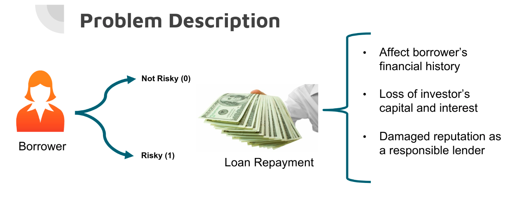
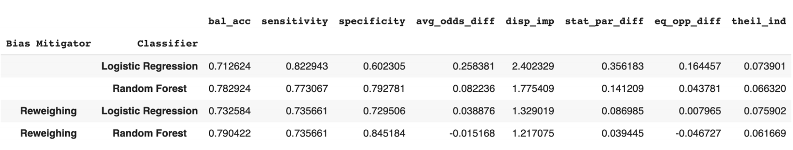
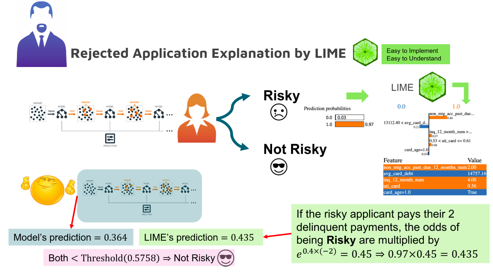
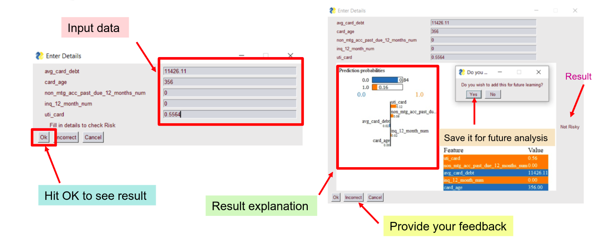

# Am I Risky? Credit assessment by an explainable and fair model

Submission by
- [Mohammad Toutiaee](https://github.com/mh2t)
- [Nikhil Ranjan](https://github.com/uNRealCoder)
- [Kushajveer Singh](https://github.com/KushajveerSingh)

Complete details can be found in the [report](Docs/Report.pdf).

This repository is the official code for our submission to the *Data
Science Competition* at the University of Georgia. We provide three types of information that are helpful to data scientists, loan officers and bank customers within a financial institute. It can help data scientists build a credit assessment vendor to predict an individual’s credit risk accurately and fair, according to the model’s factsheets. It can help a loan officer use the vendor effectively to facilitate applicants’ evaluation. Finally, bank customers can understand the reason why their applications were rejected, and they may receive advice as to what they can improve to increase the likelihood their applications are accepted.

The initial EDA for the data provided can be checked [here](https://kushajveersingh.github.io/ds_cup/). Based on an exhaustive search to identiy the best features through all different combinations among 20 predictors, we selected the following 5 predictors
- avg_card_debt
- card_age
- non_mtg_acc_past_due_12_months_num
- inq_12_month_num
- uti_card

We preferred BIC to AIC for the given problem, since BIC yields a simpler model, while AIC leads to an over-parameterized model. A simpler model is also easy to explain. A summary of top 5 models is shown below

| Rank => | 1 | 2 | 3 | 4 | 5 |
| ------- | - | - | - | - | - |
| BIC(#Params) | **3262.076(5)** | 3263.246(6) | 3263.334(6) | 3264.317(6) | 3264.468(6) |
| AIC(#Params) | 3213.339(10) | 3213.368(11) | 3213.498(10) | 3213.673(9) | 3214.125(10) |

## Final model selection

For the competition, we were required to train a Logistic Regression model and one of Random Forest, Gradient Boosing or Feed-Forward Neural Networks.

We trained a Logistic Regression model over the training set using the best features, and we chose Random Forest as the competitor model for comparison. We optimized the hyper-parameters of both models over the validation set and the results were provided in Figure 1. We used “undersample” technique to tackle with the class-imbalanced issue by only taking a random sample of observations of the majority class (i.e. non-defaulted) equal to that of the minority class (defaulted), so that we have a balanced data set. The training set size under this approach was 3172 observations in which two target classes were equally distributed.

### Logistic Regression results

The Logistic Regression generated results with the balanced-accuracy of 0.73 and 0.71 for training and test sets, respectively with the decision boundary at point 0.37 for classification.

### Random Forest results

Random Forest appeared to be a better model with the balanced-accuracy of 0.78 on both training and test sets, due to the fact that this model benefits from a complex training. The cut-off decision boundary obtained by Random Forest is larger than Logistic Regression (0.57 > 0.37), implying that this model
leniently classifies accounts as defaulted.

## Lime explanation

LIME method was utilized for a local explanation on a rejected applicant to reveal why the decision was made to reject their credit application. The explanation given will help them understand if they have been treated fairly, and also provide insight into what - if their application was rejected - they can improve in order to increase the likelihood it will be accepted in the future.

An example of LIME explanation is shown below

## API

We also build an API that can be used by the loan officier to input all the required values and get the prediction of the model. Key features of our API
- Get prediction from Random Forest model
- Get an explanation of the predicition
- Save the input data to a csv file

A working example of the API is shown below

## Requirements
- python==3.8.10
- numpy==1.20.2
- scikit-learn==0.24.1
- pandas==1.2.4
- lime==0.2.01
- sweetviz==2.1.0
- aif360==0.4.0
- aix360==0.2.1
- fairlearn==0.6.1
- PySimpleGUI==4.39.1
- imgkit==1.2.2
- R==3.6.3